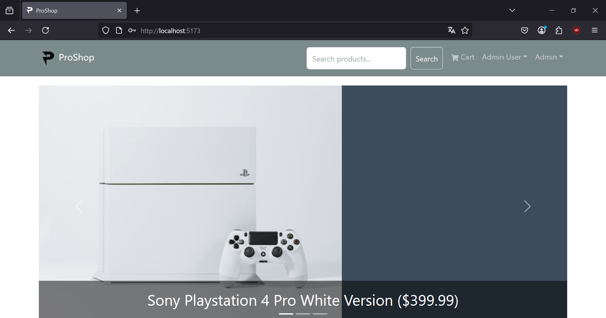
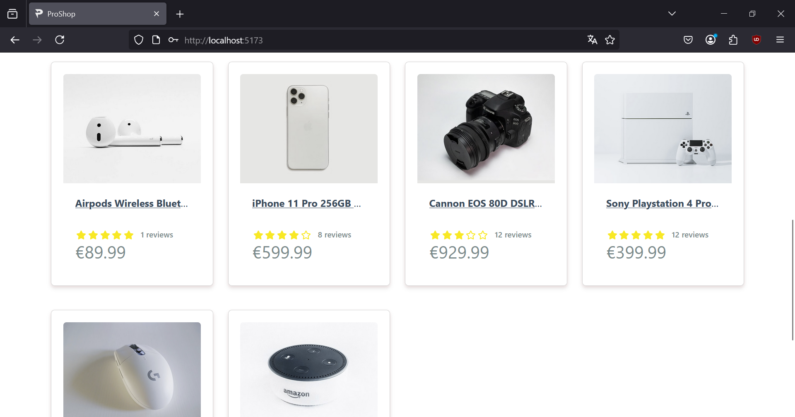
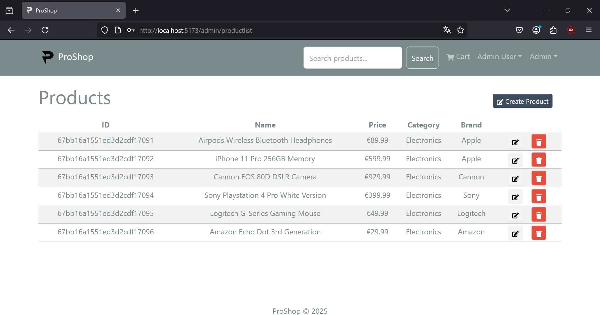
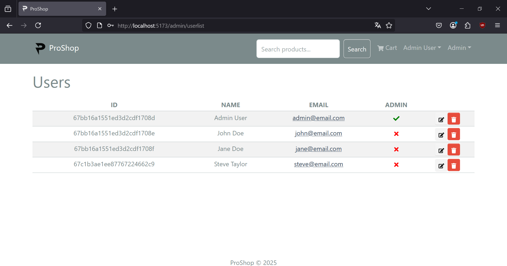
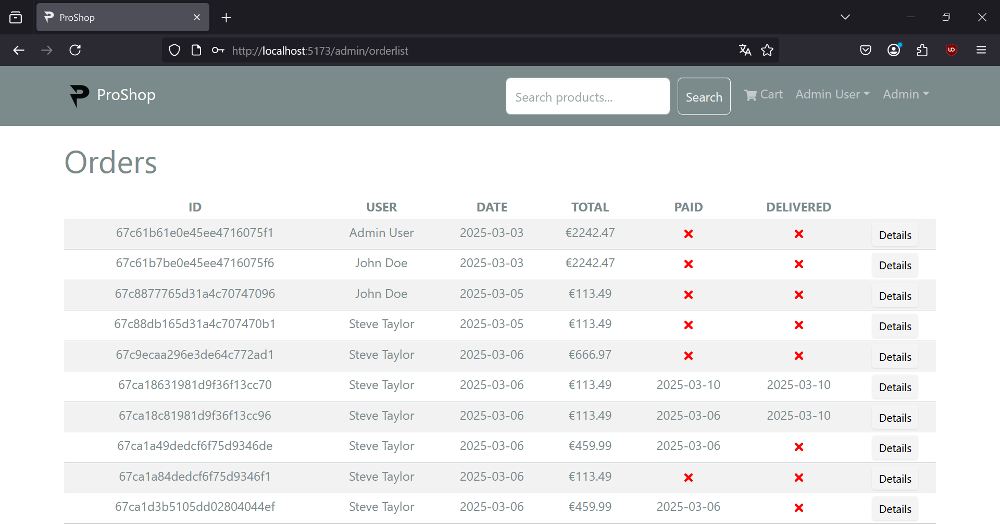
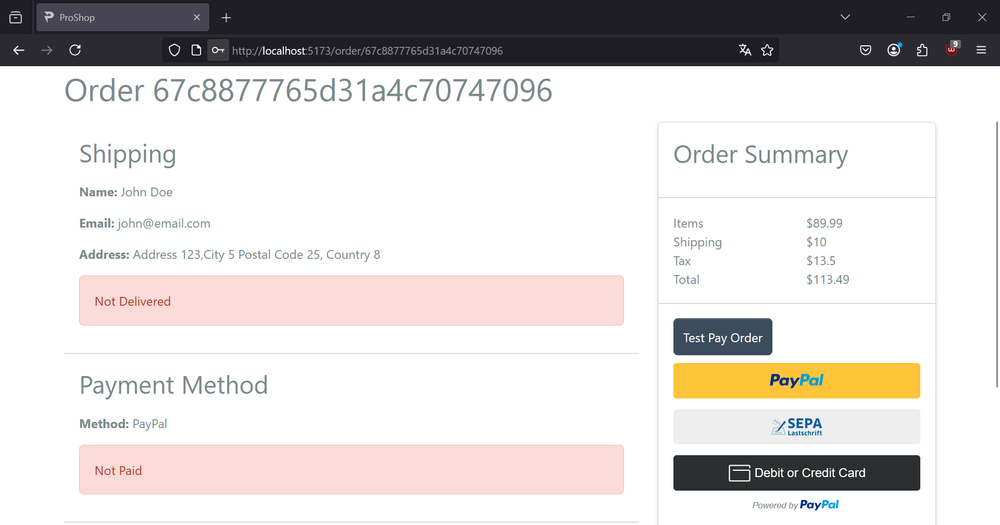
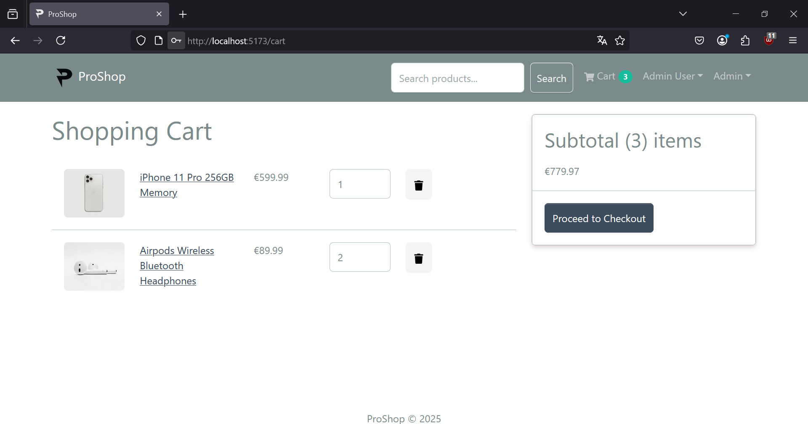
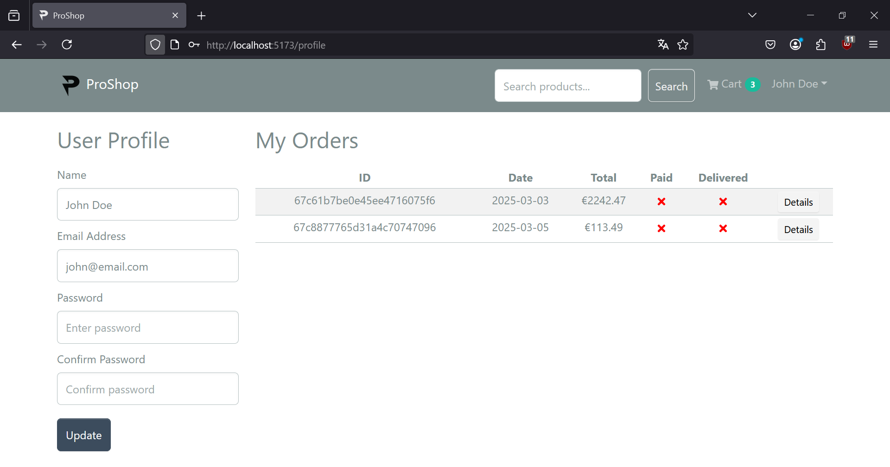
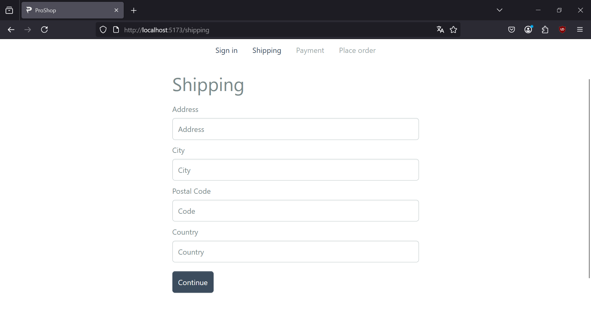
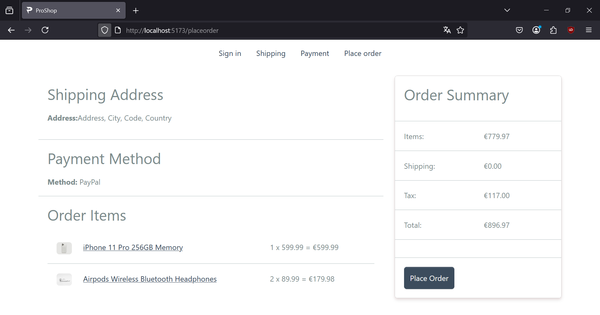

# ProShop

An eCommerce application created using the MERN stack:
 - Node.js
 - React
 - Express
 - MongoDB

### Prerequisites
Download and install [Node.js](https://nodejs.org/en/download) runtime, [React](https://react.dev/learn/installation) framework and [MongoDB](https://www.mongodb.com/docs/manual/tutorial/install-mongodb-on-windows/) database.

## Run project

1. Go to _backend_ folder and _frontend_ folder and install all dependencies from `package.json` using `npm install` or `yarn install`.
```console
proshop> cd ./backend
proshop\backend> npm install
proshop\backend> cd ..
proshop> cd ./frontend
proshop\frontend> npm install
```
2. Go to _root_ folder and install all dependencies from `package.json` using `npm install` or `yarn install`:
```console
proshop> npm install
```
3. Run backend and frontend from _root_ folder with scripts from `package.json` using `npm` and `concurrently`:
```console
proshop> npm run dev
```

## Presentation

| Homepage                                               | Latest Products                                                   | 
|-------------------------------------------------------|-------------------------------------------------------------------|
|  |  |

| Products                                              | Users                                                 | 
|-------------------------------------------------------|-------------------------------------------------------|
|  |  |

| Orders                                            | Order Details                                                 | 
|---------------------------------------------------|---------------------------------------------------------------|
|  |  |

| Shopping Cart                                                 | User Details                                                  | 
|---------------------------------------------------------------|---------------------------------------------------------------|
|  |  |

| Shipping                                                                          | Checkout                                              | 
|-----------------------------------------------------------------------------------|--------------------------------------------------------|
|  |  |
